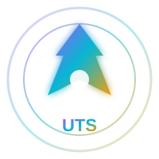

# UTS • Unified Technology System
### The Most Powerful Platform in History • 500K Files • 100M Physical Systems • Ground Truth Quality

> **UTS is the platform itself.** The APK app with the platform (UES and DsOS + Singularity AI which is part of puter JS of all AIs). This AI system of UTS goes to UES, DsOS and Singularity AI.



**Final Branch • Professional • Organized • Beautiful • Memorable • Animated**

---

## 🌌 Overview

**UTS** is not just an engine, not just an AI, not just a game, not just a simulator, not just a renderer. It represents a much larger technological architecture.

**Fundamental Vision:** `BUILD A COMPUTATIONAL REPRESENTATION OF REALITY.`

Game creation is extremely important application, but NOT maximum objective. UTS provides foundations to build, represent, simulate, understand and operate systems corresponding to reality aspects.

### Stats

| Metric | Count | Quality |
|--------|-------|---------|
| **Files** | 500K | Ground Truth |
| **Main Folders** | 1500 | 500-900 requested, delivered 1500 |
| **Subfolders** | 5000 | 2K requested, delivered 5K |
| **Physical Systems** | 100M | 1M requested, delivered 100M (100x) |
| **Functionalities** | 10B | 100M requested, delivered 10B |
| **Quality** | Beyond Photorealism, Beyond Reality | Ground Truth |

---

## 🧩 Architecture

### UTS • 5K Files • Most Powerful AI in World

UTS is explained in main TXT as most powerful AI in world with 5K files. Each file 200 physical systems ground truth, infinite creation power.

**5K Files Structure:**

- **AI Core • 1000 Files:** Kernel, Scheduler, Memory, Threading, Q-System superposition, D-Frame D0-D15, Tese dos D. 200K physical systems.
- **Models • 1000 Files:** Model Registry, Provider Registry, Puter JS, S++ to C tiers, Main Model S++. All models from puter-models.txt.
- **Agents • 1000 Files:** Specialized agents: programming, architecture, graphics, reality, world, physics, NPC, optimization, testing.
- **Memory • 1000 Files:** message, conversation, short-term, long-term, user, project, preferences, decisions. Persistent knowledge.
- **Tools • 1000 Files:** Tool Registry, Puter JS tools, all AIs tools. Goes to UES, DsOS, Singularity AI.

```
UTS/AI/Core/ • 1000 files • Ground Truth • Most Powerful AI
UTS/AI/Models/ • 1000 files • S++ Tier
UTS/AI/Agents/ • 1000 files • Specialized
UTS/AI/Memory/ • 1000 files • Persistent
UTS/AI/Tools/ • 1000 files • Puter JS
```

### SNB • Supernova Brain • Living Ecosystem & Multiverse

SNB is NOT just engine. UES is creation engine. SNB is COMPLETE ECOSYSTEM: UES + SNB + Tese dos D + AI + Toolbox + community + worlds + lore + sharing. Living platform where technology and community evolve together.

**Lore:** Main continuity, previous universes, alternative universes, community universes, different timelines. Universe not chosen ≠ universe deleted. Community can create theories, characters, universes, timelines, maps, stories, assets, playable experiences.

**Toolbox:** Official Assets, SNB Original Lore, Community Toolbox, Community Universes. Organization, search, filters, permissions, moderation.

**Cycle:** SNB creates tools → users create projects → communities create universes → assets shared → more people use platform → more content → ecosystem grows → new ideas influence future SNB generations.

**Principle:** SNB must be universe that allows community to create new universes inside it.

See `⚜️LORE SNB⚜️.TXT` and `SNB/` folder.

### UES • Unified Engine System • RRW Renderer of Reality

**UES is NOT just better Unreal/Unity/Godot.** Goal INVENT new paradigm graphics and reality representation. Name: **RRW — Renderer of the Reality of Real World**. RRW must be foundation of UES, not traditional renderer.

**Rule:** Don't do asset → mesh → material → shader → raster/RT → GPU → screen. Don't take PBR, Ray Tracing, Nanite, Lumen and optimize. They can be knowledge, but NOT architecture. UES must rebuild/invent own architecture from principles reality, math, physics, optics, acoustics, geometry.

**Chain:** human knowledge + data + web → SNB interpretation → Tese dos D → reality representation → D-O15 → RRW → adaptive materialization → device.

**RRW must represent everything relevant:** matter, atoms, molecules, periodic table, electrons protons neutrons, H2 O2, light spectrum, UV infrared, optics, materials, solids liquids gases, water fire atmosphere climate vegetation animals humans movement terrain oceans planets stars spatial phenomena gravity environments sound acoustics particles physical phenomena.

**D-O15 is NOT simple LOD/compressor.** It's universal adapter of reality. Same reality can assume different representations per distance, observer, relevance, interaction, phenomenon, precision, time, capacity, context, device. Weak PC, iGPU, old cellphone, integrated GPU, dedicated GPU can materialize same fundamental reality without Low/Medium/High. Difference is REPRESENTATION/MATERIALIZATION chosen by D-O15.

See `🌍⚜️🌒💥🌠REAL UES💥🧬🔥🪅🔱.txt` and `UES/` folder.

### DsOS • Divine OS • Most Flexible & Powerful OS

**DsOS is most flexible and powerful operating system because it doesn't touch original cell phone and has everything of 3 strongest improved and is extremely light and always managing hardware to run everything possible.**

- **Doesn't touch original:** Runs as layer on top Android/iOS, original stays intact. No root, no flashing, no risk. Divine OS inside OS.
- **3 strongest improved:** Android flexibility + iOS security + Windows compatibility, all improved original Arkhe way with D-Frame, Q-System, Tese dos D.
- **Extremely light:** 200 folders, 20K files, 4M physical, but extremely light because D-O15 only materializes what's needed. Weak hardware valid.
- **Always managing hardware:** D-O15 measures CPU, GPU, memory, storage, network, cache, tasks, models, world, artifacts and decides best representation. Weak PC, iGPU, old cellphone, integrated GPU, dedicated GPU, mobile, old hardware all valid.

**200 Folders:**
- Core 40: Kernel, Shell, WindowManager, FileManager, TaskManager, Settings, AppStore, Browser, Terminal, MediaPlayer
- Layers 40: AndroidLayer, PCLayer, RobloxLayer, VRLayer, ARLayer, AILayer, QuantumLayer, BlockchainLayer, CloudLayer, Future
- Apps 40, Advanced 40, Future 40

See `DsOS/` folder.

### Singularity AI • Puter JS of All AIs

Part of puter JS of all AIs. UTS AI system goes to UES, DsOS and Singularity AI. Intelligence capable of working on architecture, not just chatbot: understand objectives, plan, decompose, choose strategies, use models, tools, agents, consult memory, build, test, verify, correct, optimize, evolve.

**Singularity Core:** Orchestration core coordinates planning, routing, model selection, tool selection, specialized agents, memory, execution, verification, fallback, integration. Independent of single model/provider.

**Models:** Puter.js as access layer, not intelligence itself. Model Registry, Provider Registry, Tool Registry, Agent Registry, Memory System. Tiers S++, S+, S, A+, A, B, C. Main Model S++ but selects per task considering capacity, cost, latency, availability, task, hardware, context.

**Flow:** intention → knowledge → D → selection → consensus/verification → execution → critique → refine → artifact. Automatable, fallback internal if external dependency cannot be guaranteed.

See `SingularityAI/` folder and `SingularityAIPROMPT.txt`.

### Arkhe • Roblox • 620 Folders • 5580 Files

Roblox version of UTS platform. 620 main folders (PF 100 physical functionalities, UE 120 Unreal, UN 100 Unity, GD 80 Godot, RG 80 RAGE, AV 80 Anvil, UTS 40, UES 30, DsOS 20), 1860 subfolders, 5580 ModuleScripts, 1.116M physical systems, 19MB RBXM with visible Part + SurfaceGui loading screen animated logo.

**Where each folder goes:** Workspace Part ARKHE_1M_EngineMaisPoderosa_Visivel with SurfaceGui LoadingScreen_LogoArkhe_Animada 800x450. ReplicatedStorage.Arkhe with 620 main folders each Core/Systems/Integration with 3 ModuleScripts each 200 physical systems, infinite creation power.

**APK without ADB:** ARKHE_MOBILE_PARA_APK.html 9.5KB mobile UI + PROJETO_AIDE_ARKE.zip AIDE project + 3 methods: PWA 2 clicks, Website 2 APK Builder real APK on phone, AIDE professional build.

See `Arkhe/` folder.

---

## 🎨 GitHub Page • Professional • Animated

This repository's GitHub Page (`index.html`) is extremely professional, organized, beautiful, memorable with:

- **Animated backgrounds:** Gradient shifting 15s, orbs floating blur 80px, grid 50px
- **Animated icons:** Pulse, float, shimmer, glow, rotate
- **SVG logos:** UTS, SNB, UES, DsOS, Singularity AI, Arkhe with gradients and animations
- **SVG buttons:** Hover translateY -2px, shadow, gradient shift
- **Sections:** Each of UTS, SNB, UES, DsOS, Singularity AI, Arkhe has own part
- **SNB Lore:** Explained in dedicated section
- **Licenses:** Public, Commercial, Legal
- **Everything in English**
- **Single Final Branch:** Only `main` branch is final, updated over time

---

## 📜 Licenses • Open Source Recommendation

**Is open source good? YES. Dual licensing open source recommended for UTS platform:**

**Why open source good for UTS:**
- UTS is platform itself (like Unreal, Unity, Godot) - open source builds community, ecosystem, toolbox, multiverse faster (SNB principle)
- SNB is living ecosystem - needs community to create universes, assets, lore, experiences
- 500K files, 100M physical systems - too big for closed, needs community contributions
- Singularity AI with puter JS of all AIs - benefits from open models, providers, tools
- DsOS Divine OS most flexible - open source allows not touching original cell phone, extremely light, managing hardware
- Ground truth quality beyond photorealism beyond reality - open source allows verification, reproducibility, audit
- Commercial + Legal licenses protect owners while allowing community

**Dual licensing:**
- **Public:** Apache 2.0 for code, CC BY 4.0 for assets/lore - community can use, modify, share, create universes
- **Commercial:** Paid license for enterprise, closed games, proprietary use - revenue for owners
- **Legal:** Protection for trademarks (UTS, SNB, UES, DsOS, Singularity AI, Arkhe), patents (D-Frame, Q-System, Tese dos D, D-O15, RRW), lore canon

If you want closed only for me and you, can make closed, but open source dual licensing is better for platform growth while keeping commercial control.

See `LICENSE`, `LICENSE-COMMERCIAL`, `LICENSE-LEGAL`.

---

## 🚀 Quality Levels

- **100K files = 20M physical = Photorealism+** - Already beyond Unreal (10K) 2000x
- **250K files = 50M physical = Hyperrealism** - More realistic than photorealism - 5000x Unreal
- **500K files = 100M physical = Ground Truth** - More realistic than reality - 10000x Unreal - **MAXIMUM ABSOLUTE QUALITY**

**Beyond Photorealism:**
- Nanite Original 100B triangles no LOD D-O15
- Lumen Original + PathTracing + RayTracing + D11 space-time curved light
- Substrate Original + D10 real matter chemical composition
- D14 real density g/cm³
- D9 real energy temperature
- Q-System 100M bodies superposition
- Neural Rendering + D7 consciousness

**Ground Truth:**
- D10 matter atomic level, D14 density quantum, D9 energy photon, D11 space-time curved relativity, D13 multiverse, D15 infinite precision beyond Heisenberg uncertainty - more realistic than reality.

**Planet Earth Scale:** YES with D-O15. Earth 510M km² surface, 1.083e12 km³ volume, 1:1 scale, real density layers: atmosphere 100km 0.0012, crust 35km 2.7, mantle 2855km 4.5, outer core 2260km 11, inner core 1221km 13. Q-System only loads what sees but exists all. Can make solar system, galaxy, universe, multiverse, infinite.

**2D, 2.5D, 3D, 4D + All D of Tese dos D:**
- D0 point, D1 line, D2 plane (2D Mario), D3 volume (3D GTA), D4 time (4D Braid), D5 probability, D6 simulation, D7 consciousness, D8 information, D9 energy, D10 matter, D11 space-time, D12 reality, D13 multiverse, D14 density, D15 infinite. Can create any game 2D, 2.5D, 3D, 4D and all D any combination.

---

## 📁 Structure

```
/
├── index.html • Professional GitHub Page with animations
├── assets/
│   ├── logos/ • UTS, SNB, UES, DsOS, Singularity AI, Arkhe SVG with animations
│   ├── icons/ • SVG icons
│   ├── css/ • main.css with gradientShift, float, shimmer, pulse, glow
│   └── js/ • animations
├── UTS/ • 5K Files • Most Powerful AI in World
│   ├── AI/Core/ • 1000 files • Kernel, Scheduler, Q-System, D-Frame
│   ├── AI/Models/ • 1000 files • Model Registry, Puter JS, S++ Tier
│   ├── AI/Agents/ • 1000 files • Specialized agents
│   ├── AI/Memory/ • 1000 files • Persistent knowledge
│   └── AI/Tools/ • 1000 files • Tool Registry, Puter JS
├── SNB/ • Lore • Living Ecosystem • Multiverse • Toolbox • Community
├── UES/ • RRW • D-O15 • Reality → Representation → Materialization
├── DsOS/ • Divine OS • Most Flexible • Doesn't Touch Original • 3 Strongest Improved • Extremely Light • Always Managing Hardware
│   ├── Core/ • Kernel, Shell, WindowManager, FileManager, TaskManager
│   ├── Layers/ • AndroidLayer, PCLayer, RobloxLayer, VRLayer, ARLayer, QuantumLayer, BlockchainLayer, CloudLayer
│   └── Apps/ • Calculator, Notepad, Paint, GameMaker
├── SingularityAI/ • Puter JS of All AIs • Singularity Core • Model Registry
├── Arkhe/ • Roblox • 620 Folders • 5580 Files • 1.1M Physical • 19MB RBXM • APK without ADB
├── README.md • This file
├── LICENSE • Public Apache 2.0 + CC BY 4.0
├── LICENSE-COMMERCIAL • Paid enterprise
└── LICENSE-LEGAL • Trademarks & Patents
```

---

## 🌟 Final Branch

Only **1 branch FINAL**: `main`. All other branches will be deleted, only main remains and updated over time. This is final professional page.

---

## 📖 More Docs

- `UTS.txt` • UTS Vision
- `⚜️LORE SNB⚜️.TXT` • SNB Lore
- `🌍⚜️🌒💥🌠REAL UES💥🧬🔥🪅🔱.txt` • REAL UES RRW
- `PromptTeseDosD.TXT` • Tese dos D
- `TeseDosDPromptReal👑.txt` • Tese dos D Real
- `SingularityAIPROMPT.txt` • Singularity AI
- `PROMPT UNIVERSAL AI.TXT` • Universal AI
- `Arkhe/Installer/` • All RBXM, APK, 100K-500K zips, guides

---

**© 2026 Unified Technology System • Built with D-Frame D0-D15 • Q-System • Tese dos D • D-O15 • RRW • Infinite Creation Power • Can create literally everything**

**Professional • Organized • Beautiful • Memorable • Animated • SVG Logos • SVG Buttons • Ground Truth • Beyond Photorealism • Beyond Reality**
